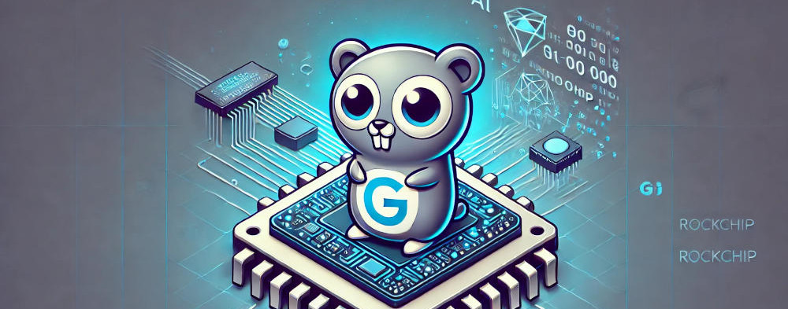

# go-rknnlite




go-rknnlite provides Go language bindings for the [RKNN Toolkit2](https://github.com/airockchip/rknn-toolkit2/tree/master)
C API interface.  It aims to provide lite bindings in the spirit of the closed source
Python lite bindings used for running AI Inference models on the Rockchip NPU 
via the RKNN software stack.

These bindings are tested on the [RK3588](https://www.rock-chips.com/a/en/products/RK35_Series/2022/0926/1660.html)
(specifically the Radxa Rock Pi 5B) and work with other RK3588 based SBC's.

Other users have reported running the bindings and examples on other models in 
the RK35xx series supported by the RKNN Toolkit2.


## Usage

To use in your Go project, get the library.
```
go get github.com/swdee/go-rknnlite
```

Or to try the examples clone the git code and data repositories.  
```
git clone https://github.com/swdee/go-rknnlite.git
cd go-rknnlite/example
git clone https://github.com/swdee/go-rknnlite-data.git data
```

Then refer to the Readme files for each example to run on command line.


## Dependencies

The [rknn-toolkit2](https://github.com/airockchip/rknn-toolkit2) must be installed on 
your system with C header files available in the system path, eg: `/usr/include/rknn_api.h`.

Refer to the official documentation on how to install this on your system as it
will vary based on OS and SBC vendor.

### Rock Pi 5B

My usage was on the Radxa Rock Pi 5B running the official Debian 11 OS image which
has the rknpu2 driver already installed.

To my knowledge [Armbian](https://www.armbian.com/) and 
[Joshua's Ubuntu](https://github.com/Joshua-Riek/ubuntu-rockchip/) 
OS images also have the driver installed for the support SBC's.

You can test if your OS has the driver installed with.
```
dmesg | grep -i rknpu
```

The output should list the driver and indicate the NPU is initialized.
```
[    5.130935] [drm] Initialized rknpu 0.8.2 20220829 for fdab0000.npu on minor 1
```

### GoCV

The examples make use of [GoCV](https://gocv.io/) for image processing.  Make sure
you have a working installation of GoCV first, see the instructions in the link
for installation on your system.


## Examples

See the [example](example) directory.

* Image Classification
  * [MobileNet Demo](example/mobilenet)
  * [Pooled Runtime Usage](example/pool)
* Object Detection
  * [YOLOv5 Demo](example/yolov5)  
  * [YOLOv8 Demo](example/yolov8)
  * [YOLOv10 Demo](example/yolov10)
  * [YOLOv11 Demo](example/yolov11) 
  * [YOLOX Demo](example/yolox) 
  * [RetinaFace](example/retinaface) - Detect human faces and identify landmark features (eyes, nose, and mouth).
* Instance Segmentation
  * [YOLOv5-seg Demo](example/yolov5-seg)
  * [YOLOv8-seg Demo](example/yolov8-seg)
* Pose Estimation
  * [YOLOv8-pose Demo](example/yolov8-pose) - Identify and display skeleton/pose of people.
* Oriented Bounding Boxes
  * [YOLOv8-obb Demo](example/yolov8-obb) - Object detection with Oriented Bounding Boxes
* License Plate Recognition
  * [LPRNet Demo](example/lprnet) 
  * [ALPR Demo](example/alpr) - Automatic License Plate Recognition combining Yolov8 and LPRNet Models.
* Text Identification
  * [PPOCR Detect](example/ppocr#ppocr-detect) - Takes an image and detects areas of text.
  * [PPOCR Recognise](example/ppocr#ppocr-recognise) - Takes an area of text and performs OCR on it.
  * [PPOCR System](example/ppocr#ppocr-system) - Combines both Detect and Recognise.
* Streaming
  * [HTTP Stream with ByteTrack Tracking](example/stream) - Demo that streams a video over HTTP with YOLO object detection and ByteTrack object tracking.  


## Pooled Runtimes

Running multiple Runtimes in a Pool allows you to take advantage of all three
NPU cores.  For our usage of an EfficentNet-Lite0 model, a single runtime has
an inference speed of 7.9ms per image, however running a Pool of 9 runtimes brings
the average inference speed down to 1.65ms per image.

See the [Pool example](example/pool).


## Other Rockchip Models

For other Rockchip models such as the RK3566 which features a single NPU core, initialise
the Runtime with the `rknnlite.NPUSkipSetCore` flag as follows.

```
rt, err := rknnlite.NewRuntime(*modelFile, rknnlite.NPUSkipSetCore)
```


## CPU Affinity

The performance of the NPU is effected by which CPU cores your program runs on, so
to achieve maximum performance we need to set the CPU Affinity.

The RK3588 for example has 4 fast Cortex-A76 cores at 2.4Ghz and 4 efficient
Cortex-A55 cores at 1.8Ghz.  By default your Go program will run across all cores
which effects performance, instead set the CPU Affinity to run on the fast Cortex-A76
cores only.

```
// set CPU affinity
err = rknnlite.SetCPUAffinity(rknnlite.RK3588FastCores)
	
if err != nil {
	log.Printf("Failed to set CPU Affinity: %v\n", err)
}
```

Constants have been set for RK3588 and RK3582 processors, for other CPU's you
can define the core mask.


### Core Mask

To create the core mask value we will use the RK3588 as an example which has 
CPU cores 0-3 as the slow A55 cores and cores 4-7 being the fast A76 cores.

You can use the provided convenience function to calculate the mask for cores 4-7.

```
mask := rknnlite.CPUCoreMask([]int{4,5,6,7})
```


## PreProcessing

Convenience functions exist for handling preprocessing of images to run inference on. 

The `preprocess.Resizer` provides functions for handling resizing and scaling of input
images to the target size needed for inference input tensors.  It will maintain
aspect ratio by scaling and applying any needed letterbox padding to the source image.

```
// load source image file
img := gocv.IMRead(filename, gocv.IMReadColor)

if img.Empty() {
		log.Fatal("Error reading image from: ", *imgFile)
}

// convert colorspace from GoCV's BGR to RGB as most models have been trained
// using RGB data 
rgbImg := gocv.NewMat()
gocv.CvtColor(img, &rgbImg, gocv.ColorBGRToRGB)

// create new resizer setting the source image size and input tensor sizes
resizer := preprocess.NewResizer(img.Cols(), img.Rows(),
  int(inputAttrs[0].Dims[1]), int(inputAttrs[0].Dims[2]))

// resize image
resizedImg := gocv.NewMat()
resizer.LetterBoxResize(rgbImg, &resizedImg, render.Black)
```

For Object Detection and Instance Segmentation the Resizer is required so 
image mask sizes can be correctly calculated and scaled back for applying as 
an overlay on the source image.


## Renderer

The `render` package provides convenience functions for drawing the bounding box
around objects or segmentation mask/outline.


## Post Processing

If a Model (ie: specific YOLO version) is not yet supported, a post processor 
could be written to handle the outputs from the RKNN engine in the same manner the
YOLOv5 code has been created.   


## Notice

This code is being used in production for Image Classification.  Over time it will be expanded
on to support more features such as Object Detection using YOLO.   The addition of
new features may cause changes or breakages in the API between commits due to the
early nature of how this library evolves.

Ensure you use Go Modules so your code is not effected, but be aware any updates may
require minor changes to your code to support the latest version.

Versioning of the library will be added at a later date once the feature set stablises.

See the [CHANGES](CHANGES.md) file for a list of breaking changes.


## Reference Material

* [rknn-toolkit2](https://github.com/airockchip/rknn-toolkit2) - RKNN software stack
tools and C API.
* [C API Reference Documentation](https://github.com/airockchip/rknn-toolkit2/blob/master/doc/04_Rockchip_RKNPU_API_Reference_RKNNRT_V2.0.0beta0_EN.pdf)
* [RKNN Model Zoo](https://github.com/airockchip/rknn_model_zoo/tree/main/examples) - RKNN maintained Model Zoo with example code