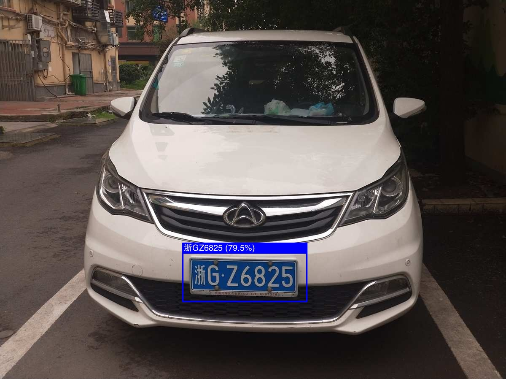

# ALPR Example

## Overview

This example demonstrates full Automatic License Plate Recognition (ALPR) by using
two models
  1. YOLOv8n - Used for license plate detection in an image
  2. LPRNet - Used for number plate recognition to read the text/characters on the number plate

The YOLOv8n model was trained on the 
[License Plate Recognition Computer Vision Project Dataset](https://universe.roboflow.com/roboflow-universe-projects/license-plate-recognition-rxg4e)
 then converted to ONNX and finally compiled to RKNN format.  You have to use
[Rockchips fork](https://github.com/airockchip/ultralytics_yolov8) of the 
Ultralytics YOLOv8 repository due to some optimizations they have made for the NPU discussed 
[here](https://github.com/rockchip-linux/rknn-toolkit2/issues/272).  

Use the `ultralytics/engine/exporter.py` script in this repository to convert the
PyTorch model to ONNX.

Then compile from ONNX to RKNN using the [conversion script](https://github.com/airockchip/rknn_model_zoo/blob/main/examples/yolov8/python/convert.py)
from the Model Zoo.

The LPRNet model used from the RKNN Model Zoo is for Chinese License Plates.
I don't think it's very good, the input size of 94x24 pixels is too small and 
the dataset it was trained on doesn't use angled number plate images.  
These factors reduce accuracy, so training your own model for real world 
usage would be better.


## Usage


Make sure you have downloaded the data files first for the examples.
You only need to do this once for all examples.

```
cd example/
git clone https://github.com/swdee/go-rknnlite-data.git data
```

Run the ALPR example.
```
cd example/alpr
go run alpr.go
```

This will result in the output of:
```
Model first run speed: YOLO inference=25.336366ms, YOLO post processing=137.371µs, Plate recognition=7.908609ms, Plate post processing=456.737µs, Total time=33.839083ms
Saved object detection result to ../data/car-cn-alpr-out.jpg
Benchmark time=1.629993653s, count=50, average total time=32.599873ms
done
```

The saved JPG image with object detection markers and license plate recognised.  The 
percentage in brackets indicates the confidence score from the YOLO model for 
license plate detection.



See help for passing parameters to try your own images.
```
$ go run alpr.go -h
Usage of /tmp/go-build506851743/b001/exe/alpr:
  -f string
        The TTF font to use (default "../data/fzhei-b01s-regular.ttf")
  -i string
        Image file to run object detection on (default "../data/car-cn.jpg")
  -l string
        RKNN compiled LPRNet model file (default "../data/lprnet-rk3588.rknn")
  -m string
        RKNN compiled YOLO model file (default "../data/lpd-yolov8n-640-640-rk3588.rknn")
  -o string
        The output JPG file with object detection markers (default "../data/car-cn-alpr-out.jpg")
  -t string
        The text drawing mode [cn|en] (default "cn")
```


