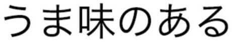

# PaddleOCR (PPOCR)

[PaddleOCR](https://github.com/PaddlePaddle/PaddleOCR) provides multilingual
OCR based on the PaddlePaddle lightweight OCR system, supporting recognition of
80+ languages.

## Usage

Make sure you have downloaded the data files first for the examples.
You only need to do this once for all examples.

```
cd example/
git clone https://github.com/swdee/go-rknnlite-data.git data
```

Run the PPOCR Recognition example.
```
cd example/ppocr-rec
go run ppocr-rec.go
```

This will result in the output of:
```
Driver Version: 0.8.2, API Version: 1.6.0 (9a7b5d24c@2023-12-13T17:31:11)
Model Input Number: 1, Ouput Number: 1
Input tensors:
  index=0, name=x, n_dims=4, dims=[1, 48, 320, 3], n_elems=46080, size=92160, fmt=NHWC, type=FP16, qnt_type=AFFINE, zp=0, scale=1.000000
Output tensors:
  index=0, name=softmax_11.tmp_0, n_dims=3, dims=[1, 40, 6625, 0], n_elems=265000, size=530000, fmt=UNDEFINED, type=FP16, qnt_type=AFFINE, zp=0, scale=1.000000
Model first run speed: inference=24.707428ms, post processing=478.906µs, total time=25.186334ms
Recognize result: JOINT, score=0.71
Benchmark time=321.330438ms, count=10, average total time=32.133043ms
done
```

Sample images input and text detected.


| Input Image                       | Text Recognised | Confidence Score |
|-----------------------------------|-----------------|------------------|
|            | JOINT           | 0.71             |
|          |    浙G·Z6825        | 0.65         |
|        |    中华老字号        | 0.71          |
|  |    MOZZARELLA - 188        | 0.67  |


## Other Language Models

The Model `ppocrv4_rec-rk3588.rknn` provided in this example has only been trained
on English alphabet and Chinese characters.  For other languages see the
[vendors documentation](https://github.com/PaddlePaddle/PaddleOCR/blob/main/doc/doc_en/models_list_en.md)
for downloading these models.  These instructions are based on those [here](https://github.com/PaddlePaddle/PaddleOCR/blob/8b71785141e1f14d0df1a92412553fc90db47326/deploy/fastdeploy/rockchip/cpp/README.md).

Download the `inference model` for the language you require, in this example we download
the [Japanese model](https://paddleocr.bj.bcebos.com/PP-OCRv3/multilingual/japan_PP-OCRv3_rec_infer.tar).
```
wget https://paddleocr.bj.bcebos.com/PP-OCRv3/multilingual/japan_PP-OCRv3_rec_infer.tar 
```

Unpack the model file.
```
tar -xvf japan_PP-OCRv3_rec_infer.tar
```

Download the [dictionary file](https://github.com/PaddlePaddle/PaddleOCR/blob/main/ppocr/utils/dict/japan_dict.txt)
from [this directory](https://github.com/PaddlePaddle/PaddleOCR/tree/main/ppocr/utils/dict).
```
wget https://raw.githubusercontent.com/PaddlePaddle/PaddleOCR/main/ppocr/utils/dict/japan_dict.txt
```

Then convert this model to ONNX format using [Paddle2ONNX](https://github.com/PaddlePaddle/PaddleOCR/tree/main/deploy/paddle2onnx).

Install Paddle2ONNX
```
pip3 install paddlepaddle
pip3 install paddle2onnx
```

Convert to ONNX
```
paddle2onnx --model_dir ./japan_PP-OCRv3_rec_infer/ \
--model_filename inference.pdmodel \
--params_filename inference.pdiparams \
--save_file ./japanv3-rec.onnx
```

Change the Input shape parameters.
```
python3 -m paddle2onnx.optimize --input_model japanv3-rec.onnx \
--output_model japanv3-rec.onnx --input_shape_dict "{'x':[1,3,48,320]}"
```

Download the [export script](https://github.com/PaddlePaddle/PaddleOCR/blob/main/deploy/fastdeploy/rockchip/rknpu2_tools/export.py) to convert the ONNX file to RKNN.
```
wget https://raw.githubusercontent.com/PaddlePaddle/PaddleOCR/main/deploy/fastdeploy/rockchip/rknpu2_tools/export.py
```

Download the export script [config file](https://github.com/PaddlePaddle/PaddleOCR/blob/main/deploy/fastdeploy/rockchip/rknpu2_tools/config/ppocrv3_rec.yaml).
```
wget https://raw.githubusercontent.com/PaddlePaddle/PaddleOCR/main/deploy/fastdeploy/rockchip/rknpu2_tools/config/ppocrv3_rec.yaml
```

Edit the config file and modify the `model_path` to point to our ONNX input model and set `output_folder` to current directory.
```
model_path: ./japanv3-rec.onnx

output_folder: "./"
```

Compile ONNX to RKNN which creates the file `japanv3-rec_rk3588_unquantized.rknn`.
```
python3 export.py --config_path ppocrv3_rec.yaml --target_platform rk3588
```

Edit the character keys file `japan_dict.txt` as the number of characters in this file is not the
same as those trained on the model (for some unknown reason).  Make the following changes;

1. Add the word `blank` at the top of the on line 1.
2. Scroll to end of file and replace the last line which is a single space character with the word `__space__`.
3. Add on a new line after the `__space__` character, the word `@dummy`.

You can now use the compiled RKNN and dictionary keys file to perform OCR on an image.
```
go run ppocr-rec.go -k japan_dict.txt -m japanv3-rec_rk3588_unquantized.rknn -i jptext.jpg
```

| Input Image                       | Text Recognised | Confidence Score |
|-----------------------------------|-----------------|------------------|
|            | つま味のある           | 0.76      |

Whilst the text on the image above is accurate I found the Japanese version to be
rather poor.  It does not do well with Horizontally written text or hand written
kana. Some others also found this [here](https://qiita.com/sakamoto1209/items/59288cd88133852d2e9e)
and [here](https://zenn.dev/shimat/articles/6ac851fbba2e0bae05c8).

Whist the PaddleOCR is a good project it has become unmaintained and dated, there
is a [discussion](https://github.com/PaddlePaddle/PaddleOCR/issues/11859) on how 
to improve the situation.  Hopefully the other languages get updates to v4 models
in the future.


## Background

This PPOCR example is a Go conversion of the [C API example](https://github.com/airockchip/rknn_model_zoo/blob/main/examples/PPOCR/PPOCR-Rec/cpp/main.cc).


