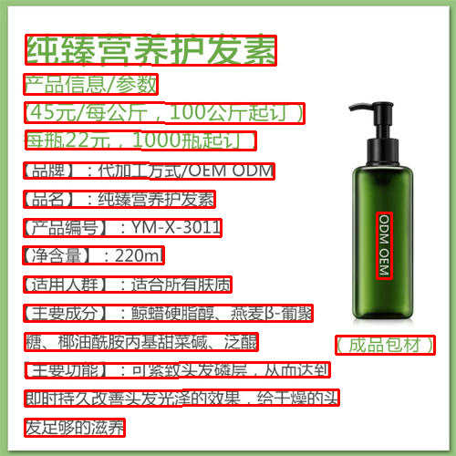
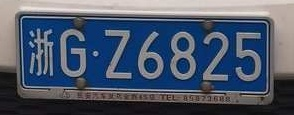
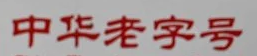

# PaddleOCR (PPOCR)

[PaddleOCR](https://github.com/PaddlePaddle/PaddleOCR) provides multilingual
OCR based on the PaddlePaddle lightweight OCR system, supporting recognition of
80+ languages.

Mutiple examples are provided as the following:

1. [PPOCR Detect](#ppocr-detect) - Takes an image and detects areas of text.
2. [PPOCR Recognise](#ppocr-recognise) - Takes an area of text and performs OCR on it.
3. [PPOCR System](#ppocr-system) - Combines both Detect and Recognise.


## Example data


Make sure you have downloaded the data files first for the examples.
You only need to do this once for all examples.

```
cd example/
git clone https://github.com/swdee/go-rknnlite-data.git data
```


## PPOCR Detect


### Usage

Run the PPOCR Detection example.
```
cd example/ppocr
go run detect.go common.go
```

This will result in the output of:
```
Driver Version: 0.8.2, API Version: 1.6.0 (9a7b5d24c@2023-12-13T17:31:11)
Model Input Number: 1, Ouput Number: 1
Input tensors:
  index=0, name=x, n_dims=4, dims=[1, 480, 480, 3], n_elems=691200, size=691200, fmt=NHWC, type=INT8, qnt_type=AFFINE, zp=-14, scale=0.018658
Output tensors:
  index=0, name=sigmoid_0.tmp_0, n_dims=4, dims=[1, 1, 480, 480], n_elems=230400, size=230400, fmt=NCHW, type=INT8, qnt_type=AFFINE, zp=-128, scale=0.003922
Model first run speed: inference=27.746374ms, post processing=2.968795ms, total time=30.715169ms
[0]: [(27, 459), (136, 459), (136, 478), (27, 478)] 0.991298
[1]: [(27, 428), (371, 427), (371, 444), (27, 445)] 0.912538
[2]: [(28, 398), (361, 397), (361, 413), (28, 414)] 0.953752
[3]: [(368, 368), (476, 368), (476, 388), (368, 388)] 0.989887
[4]: [(27, 365), (282, 365), (282, 384), (27, 384)] 0.975041
[5]: [(26, 334), (342, 334), (342, 352), (26, 352)] 0.956719
[6]: [(26, 303), (253, 303), (253, 320), (26, 320)] 0.974053
[7]: [(25, 270), (179, 270), (179, 289), (25, 289)] 0.990559
[8]: [(26, 240), (242, 240), (242, 259), (26, 259)] 0.986159
[9]: [(413, 233), (429, 233), (429, 305), (413, 305)] 0.970001
[10]: [(26, 209), (235, 209), (235, 227), (26, 227)] 0.995540
[11]: [(26, 178), (300, 179), (300, 196), (26, 195)] 0.991055
[12]: [(28, 143), (280, 144), (280, 164), (28, 163)] 0.974824
[13]: [(27, 112), (333, 113), (333, 135), (27, 134)] 0.899956
[14]: [(26, 81), (172, 81), (172, 103), (26, 103)] 0.994091
[15]: [(28, 38), (302, 39), (302, 71), (28, 70)] 0.960498
Saved image to ../data/ppocr-det-out.png
Benchmark time=3.540086219s, count=100, average total time=35.400862ms
done
```

Bounding boxes have been drawn around detected text areas.




### Docker

To run the PPOCR Detection example using the prebuilt docker image, make sure the data files have been downloaded first,
then run.
```
# from project root directory

docker run --rm \
  --device /dev/dri:/dev/dri \
  -v "$(pwd):/go/src/app" \
  -v "$(pwd)/example/data:/go/src/data" \
  -v "/usr/include/rknn_api.h:/usr/include/rknn_api.h" \
  -v "/usr/lib/librknnrt.so:/usr/lib/librknnrt.so" \
  -w /go/src/app \
  swdee/go-rknnlite:latest \
  go run ./example/ppocr/detect.go ./example/ppocr/common.go
```


### Background

This PPOCR Detect example is a Go conversion of the [C API example](https://github.com/airockchip/rknn_model_zoo/blob/main/examples/PPOCR/PPOCR-Det/cpp/main.cc).


## PPOCR Recognise

### Usage

Run the PPOCR Recognition example.
```
cd example/ppocr
go run recognise.go common.go
```

This will result in the output of:
```
Driver Version: 0.8.2, API Version: 1.6.0 (9a7b5d24c@2023-12-13T17:31:11)
Model Input Number: 1, Ouput Number: 1
Input tensors:
  index=0, name=x, n_dims=4, dims=[1, 48, 320, 3], n_elems=46080, size=92160, fmt=NHWC, type=FP16, qnt_type=AFFINE, zp=0, scale=1.000000
Output tensors:
  index=0, name=softmax_11.tmp_0, n_dims=3, dims=[1, 40, 6625, 0], n_elems=265000, size=530000, fmt=UNDEFINED, type=FP16, qnt_type=AFFINE, zp=0, scale=1.000000
Model first run speed: inference=26.486118ms, post processing=461.404µs, total time=26.947522ms
Recognize result: JOINT, score=0.71
Benchmark time=2.528564774s, count=100, average total time=25.285647ms
done
```

Sample images input and text detected.


| Input Image                       | Text Recognised | Confidence Score |
|-----------------------------------|-----------------|------------------|
|            | JOINT           | 0.71             |
|          |    浙G·Z6825        | 0.65         |
|        |    中华老字号        | 0.71          |
|  |    MOZZARELLA - 188        | 0.67  |


### Docker

To run the PPOCR Recognition example using the prebuilt docker image, make sure the data files have been downloaded first,
then run.
```
# from project root directory

docker run --rm \
  --device /dev/dri:/dev/dri \
  -v "$(pwd):/go/src/app" \
  -v "$(pwd)/example/data:/go/src/data" \
  -v "/usr/include/rknn_api.h:/usr/include/rknn_api.h" \
  -v "/usr/lib/librknnrt.so:/usr/lib/librknnrt.so" \
  -w /go/src/app \
  swdee/go-rknnlite:latest \
  go run ./example/ppocr/recognise.go ./example/ppocr/common.go
```


### Other Language Models

The Model `ppocrv4_rec-rk3588.rknn` provided in this example has only been trained
on English alphabet and Chinese characters.  For other languages see the
[vendors documentation](https://github.com/PaddlePaddle/PaddleOCR/blob/main/doc/doc_en/models_list_en.md)
for downloading these models.  These instructions are based on those [here](https://github.com/PaddlePaddle/PaddleOCR/blob/8b71785141e1f14d0df1a92412553fc90db47326/deploy/fastdeploy/rockchip/cpp/README.md).

Download the `inference model` for the language you require, in this example we download
the [Japanese model](https://paddleocr.bj.bcebos.com/PP-OCRv3/multilingual/japan_PP-OCRv3_rec_infer.tar).
```
wget https://paddleocr.bj.bcebos.com/PP-OCRv3/multilingual/japan_PP-OCRv3_rec_infer.tar 
```

Unpack the model file.
```
tar -xvf japan_PP-OCRv3_rec_infer.tar
```

Download the [dictionary file](https://github.com/PaddlePaddle/PaddleOCR/blob/main/ppocr/utils/dict/japan_dict.txt)
from [this directory](https://github.com/PaddlePaddle/PaddleOCR/tree/main/ppocr/utils/dict).
```
wget https://raw.githubusercontent.com/PaddlePaddle/PaddleOCR/main/ppocr/utils/dict/japan_dict.txt
```

Then convert this model to ONNX format using [Paddle2ONNX](https://github.com/PaddlePaddle/PaddleOCR/tree/main/deploy/paddle2onnx).

Install Paddle2ONNX
```
pip3 install paddlepaddle
pip3 install paddle2onnx
```

Convert to ONNX
```
paddle2onnx --model_dir ./japan_PP-OCRv3_rec_infer/ \
--model_filename inference.pdmodel \
--params_filename inference.pdiparams \
--save_file ./japanv3-rec.onnx
```

Change the Input shape parameters.
```
python3 -m paddle2onnx.optimize --input_model japanv3-rec.onnx \
--output_model japanv3-rec.onnx --input_shape_dict "{'x':[1,3,48,320]}"
```

Download the [export script](https://github.com/PaddlePaddle/PaddleOCR/blob/main/deploy/fastdeploy/rockchip/rknpu2_tools/export.py) to convert the ONNX file to RKNN.
```
wget https://raw.githubusercontent.com/PaddlePaddle/PaddleOCR/main/deploy/fastdeploy/rockchip/rknpu2_tools/export.py
```

Download the export script [config file](https://github.com/PaddlePaddle/PaddleOCR/blob/main/deploy/fastdeploy/rockchip/rknpu2_tools/config/ppocrv3_rec.yaml).
```
wget https://raw.githubusercontent.com/PaddlePaddle/PaddleOCR/main/deploy/fastdeploy/rockchip/rknpu2_tools/config/ppocrv3_rec.yaml
```

Edit the config file and modify the `model_path` to point to our ONNX input model and set `output_folder` to current directory.
```
model_path: ./japanv3-rec.onnx

output_folder: "./"
```

Compile ONNX to RKNN which creates the file `japanv3-rec_rk3588_unquantized.rknn`.
```
python3 export.py --config_path ppocrv3_rec.yaml --target_platform rk3588
```

Edit the character keys file `japan_dict.txt` as the number of characters in this file is not the
same as those trained on the model (for some unknown reason).  Make the following changes;

1. Add the word `blank` at the top of the on line 1.
2. Scroll to end of file and replace the last line which is a single space character with the word `__space__`.
3. Add on a new line after the `__space__` character, the word `@dummy`.

You can now use the compiled RKNN and dictionary keys file to perform OCR on an image.
```
go run recognise.go common.go -k japan_dict.txt -m japanv3-rec_rk3588_unquantized.rknn -i jptext.jpg
```

| Input Image                       | Text Recognised | Confidence Score |
|-----------------------------------|-----------------|------------------|
|            | つま味のある           | 0.76      |

Whilst the text on the image above is some what accurate I found the Japanese version to be
rather poor.  It does not do well with Horizontally written text or hand written
kana. Some others also found this [here](https://qiita.com/sakamoto1209/items/59288cd88133852d2e9e)
and [here](https://zenn.dev/shimat/articles/6ac851fbba2e0bae05c8).

Whist the PaddleOCR is a good project it has become unmaintained and dated, there
is a [discussion](https://github.com/PaddlePaddle/PaddleOCR/issues/11859) on how 
to improve the situation.  Hopefully the other languages get updates to v4 models
in the future.

### Background

This PPOCR Recognise example is a Go conversion of the [C API example](https://github.com/airockchip/rknn_model_zoo/blob/main/examples/PPOCR/PPOCR-Rec/cpp/main.cc).


## PPOCR System


### Usage

Run the PPOCR System example.
```
cd example/ppocr
go run system.go common.go
```

This will result in the output of:
```
Driver Version: 0.8.2, API Version: 1.6.0 (9a7b5d24c@2023-12-13T17:31:11)
Model Input Number: 1, Ouput Number: 1
Input tensors:
  index=0, name=x, n_dims=4, dims=[1, 48, 320, 3], n_elems=46080, size=92160, fmt=NHWC, type=FP16, qnt_type=AFFINE, zp=0, scale=1.000000
Output tensors:
  index=0, name=softmax_11.tmp_0, n_dims=3, dims=[1, 40, 6625, 0], n_elems=265000, size=530000, fmt=UNDEFINED, type=FP16, qnt_type=AFFINE, zp=0, scale=1.000000
Driver Version: 0.8.2, API Version: 1.6.0 (9a7b5d24c@2023-12-13T17:31:11)
Model Input Number: 1, Ouput Number: 1
Input tensors:
  index=0, name=x, n_dims=4, dims=[1, 480, 480, 3], n_elems=691200, size=691200, fmt=NHWC, type=INT8, qnt_type=AFFINE, zp=-14, scale=0.018658
Output tensors:
  index=0, name=sigmoid_0.tmp_0, n_dims=4, dims=[1, 1, 480, 480], n_elems=230400, size=230400, fmt=NCHW, type=INT8, qnt_type=AFFINE, zp=-128, scale=0.003922
[0]: [(28, 38), (302, 39), (302, 71), (28, 70)] 0.960498
Recognize result: 纯臻营养护发素, score=0.71
[1]: [(26, 81), (172, 81), (172, 103), (26, 103)] 0.994091
Recognize result: 产品信息/参数, score=0.71
[2]: [(27, 112), (333, 113), (333, 135), (27, 134)] 0.899956
Recognize result: （45元/每公斤，100公斤起订）, score=0.69
[3]: [(28, 143), (280, 144), (280, 164), (28, 163)] 0.974824
Recognize result: 每瓶22元，1000瓶起订）, score=0.70
[4]: [(26, 178), (300, 179), (300, 196), (26, 195)] 0.991055
Recognize result: （品牌】：代加工方式/OEMODM, score=0.67
[5]: [(26, 209), (235, 209), (235, 227), (26, 227)] 0.995540
Recognize result: 【品名】：纯臻营养护发素, score=0.70
[6]: [(26, 240), (242, 240), (242, 259), (26, 259)] 0.986159
Recognize result: 【产品编号】：YM-X-3011, score=0.71
[7]: [(413, 233), (429, 233), (429, 305), (413, 305)] 0.970001
Recognize result: ODMOEM, score=0.71
[8]: [(25, 270), (179, 270), (179, 289), (25, 289)] 0.990559
Recognize result: 【净含量】：220ml, score=0.71
[9]: [(26, 303), (253, 303), (253, 320), (26, 320)] 0.974053
Recognize result: 【适用人群】：适合所有肤质, score=0.71
[10]: [(26, 334), (342, 334), (342, 352), (26, 352)] 0.956719
Recognize result: （主要成分》:皖蜡硬脂醇、燕麦-葡聚, score=0.59
[11]: [(27, 365), (282, 365), (282, 384), (27, 384)] 0.975041
Recognize result: 糖、椰油酰胺丙基甜菜碱、泛酸, score=0.68
[12]: [(368, 368), (476, 368), (476, 388), (368, 388)] 0.989887
Recognize result: （成品包材）, score=0.71
[13]: [(28, 398), (361, 397), (361, 413), (28, 414)] 0.953752
Recognize result: 干型功能:可降较以发确员，从而大有, score=0.41
[14]: [(27, 428), (371, 427), (371, 444), (27, 445)] 0.912538
Recognize result: 即时语久改基发光器的双果，给干强的头, score=0.47
[15]: [(27, 459), (136, 459), (136, 478), (27, 478)] 0.991298
Recognize result: 发足够的滋养, score=0.71
Run speed:
  Detect processing=32.056505ms
  Recognise processing=362.731907ms
  Total time=394.788412ms
done
```

As can be seen all of the text area's from the image processed at the 
PPOCR Detect stage have had OCR applied using PPOCR Recognise.  Displayed
are the Chinese and English characters read from the OCR process.

### Docker

To run the PPOCR System example using the prebuilt docker image, make sure the data files have been downloaded first,
then run.
```
# from project root directory

docker run --rm \
  --device /dev/dri:/dev/dri \
  -v "$(pwd):/go/src/app" \
  -v "$(pwd)/example/data:/go/src/data" \
  -v "/usr/include/rknn_api.h:/usr/include/rknn_api.h" \
  -v "/usr/lib/librknnrt.so:/usr/lib/librknnrt.so" \
  -w /go/src/app \
  swdee/go-rknnlite:latest \
  go run ./example/ppocr/system.go ./example/ppocr/common.go
```


### Background

This PPOCR System example is a Go conversion of the [C API example](https://github.com/airockchip/rknn_model_zoo/blob/main/examples/PPOCR/PPOCR-System/cpp/main.cc).

