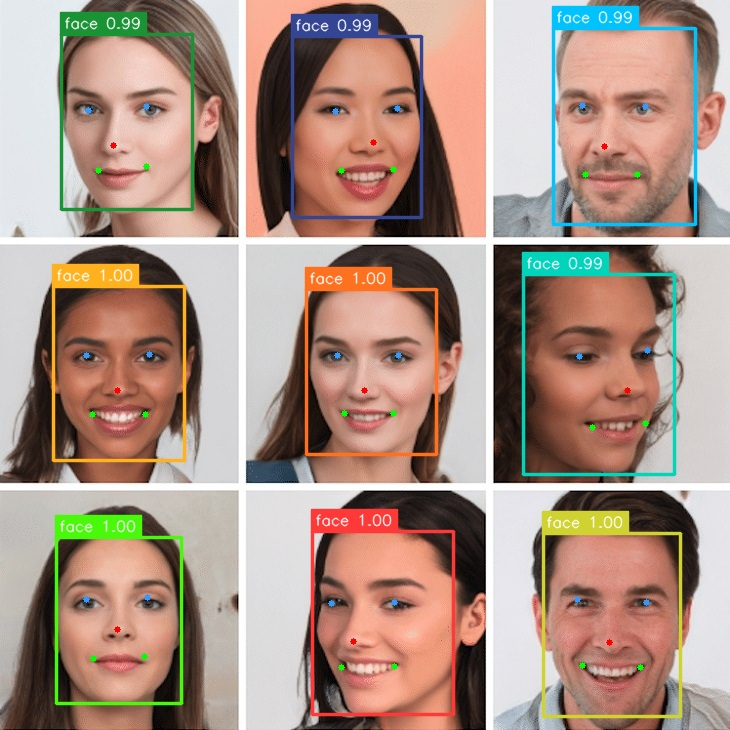

# RetinaFace Example

## Overview


Detect human faces in images and identify face landmark features (eyes, nose, and mouth).


## Usage

Make sure you have downloaded the data files first for the examples.
You only need to do this once for all examples.

```
cd example/
git clone --depth=1 https://github.com/swdee/go-rknnlite-data.git data
```

Run the RetinaFace example.
```
cd example/retinaface
go run retinaface.go
```

This will result in the output of:
```
Driver Version: 0.8.2, API Version: 1.6.0 (9a7b5d24c@2023-12-13T17:31:11)
Model Input Number: 1, Ouput Number: 3
Input tensors:
  index=0, name=input0, n_dims=4, dims=[1, 320, 320, 3], n_elems=307200, size=307200, fmt=NHWC, type=INT8, qnt_type=AFFINE, zp=-14, scale=1.074510
Output tensors:
  index=0, name=output0, n_dims=3, dims=[1, 4200, 4, 0], n_elems=16800, size=16800, fmt=UNDEFINED, type=INT8, qnt_type=AFFINE, zp=0, scale=0.044699
  index=1, name=572, n_dims=3, dims=[1, 4200, 2, 0], n_elems=8400, size=16800, fmt=UNDEFINED, type=FP16, qnt_type=AFFINE, zp=0, scale=1.000000
  index=2, name=571, n_dims=3, dims=[1, 4200, 10, 0], n_elems=42000, size=42000, fmt=UNDEFINED, type=INT8, qnt_type=AFFINE, zp=-22, scale=0.086195
face @ (312 531 453 714) 0.998047
face @ (306 289 436 454) 0.997559
face @ (53 286 184 460) 0.996582
face @ (543 533 680 716) 0.996094
face @ (56 537 181 703) 0.995605
face @ (61 34 192 209) 0.994629
face @ (523 274 674 474) 0.994141
face @ (553 28 695 224) 0.991211
face @ (292 36 421 217) 0.991211
Model first run speed: inference=8.527569ms, post processing=217.287µs, rendering=2.15333ms, total time=10.898186ms
Saved object detection result to ../data/face-out.jpg
Benchmark time=179.448201ms, count=20, average total time=8.97241ms
done
```

The saved JPG image with face landmarks indicated.




See the help for command line parameters.
```
$ go run retinaface.go --help

Usage of /tmp/go-build3929104604/b001/exe/retinaface:
  -i string
        Image file to run inference on (default "../data/face.jpg")
  -m string
        RKNN compiled Retina Face model file (default "../data/retinaface-320-320-rk3588.rknn")
  -o string
        The output JPG file with face detection markers (default "../data/face-out.jpg")
```


### Docker

To run the RetinaFace example using the prebuilt docker image, make sure the data files have been downloaded first,
then run.
```
# from project root directory

docker run --rm \
  --device /dev/dri:/dev/dri \
  -v "$(pwd):/go/src/app" \
  -v "$(pwd)/example/data:/go/src/data" \
  -v "/usr/include/rknn_api.h:/usr/include/rknn_api.h" \
  -v "/usr/lib/librknnrt.so:/usr/lib/librknnrt.so" \
  -w /go/src/app \
  swdee/go-rknnlite:latest \
  go run ./example/retinaface/retinaface.go
```


## Background

This RetinaFace example is a Go conversion of the [C API example](https://github.com/airockchip/rknn_model_zoo/blob/main/examples/RetinaFace/cpp/main.cc).


