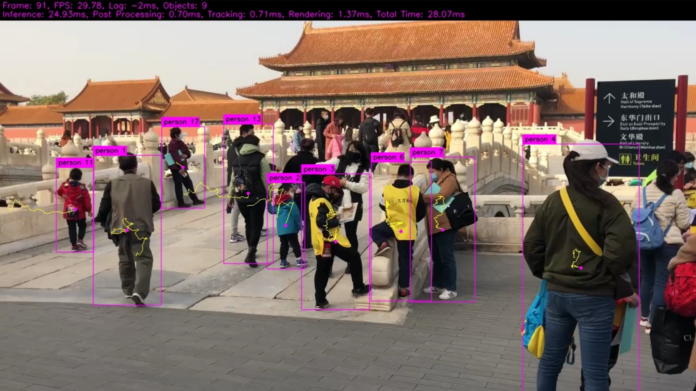
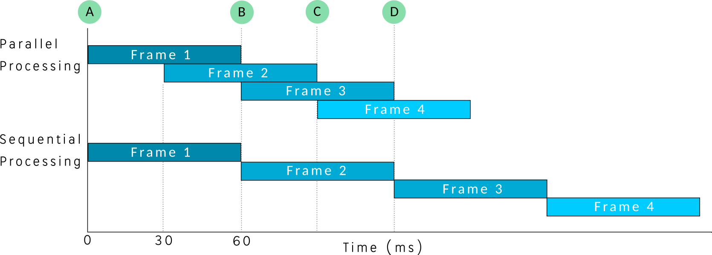

# HTTP Stream with ByteTrack Object Tracking

A demo that streams video over HTTP with object detection using YOLOv5, YOLOv8, 
YOLOv10, or YOLOX
plus [ByteTrack](https://github.com/ifzhang/ByteTrack) object tracking to 
assign an ID to each object and track them over time.

This demo uses a 720p MP4 video file to stream in a loop over HTTP, it could be adjusted
easily to use a camera instead.

It also makes use of the [Pool](../pool) feature to run multiple of the same YOLO model concurrently
for better performance.



In the above image the statistics at the top represent the following.

| Field           | Description                                                                                                                                                                                                                                        |
|-----------------|----------------------------------------------------------------------------------------------------------------------------------------------------------------------------------------------------------------------------------------------------|
| Frame           | The current frame number                                                                                                                                                                                                                           |
| FPS             | The frames per second being streamed                                                                                                                                                                                                               |
| Lag             | A negative lag means the inference and processing time completed in less time than the interval taken to stream at 30 FPS.  A positive number indicates processing time took longer and there is a playback lag from when the video first started. |
| Objects         | The number of objects detected in the scene                                                                                                                                                                                                        |
| Inference       | The time it took to perform YOLO inferencing on the RKNN backend                                                                                                                                                                                   |
| Post Processing | Time it took to post process the YOLO detection results from inferencing                                                                                                                                                                           |
| Tracking        | Time it took to perform ByteTrack object tracking                                                                                                                                                                                                  |
| Rendering       | How long it took to draw objects and annotate the image with this statistical data                                                                                                                                                                 |
| Total Time      | Total time it took from receiving the video frame and processing it to be sent to browser                                                                                                                                                          |

Each detected object has a bounding box drawn around it with classification label `person` 
and the number proceeding is the unique tracking id assigned from ByteTrack.   The pink circle
in the center of the bounding box represents the center and yellow line is the trail (path)
of the motion the tracked object took.  This effect replicates the trail effect discuss
at the [Ultralytics multi-object tracking page](https://docs.ultralytics.com/modes/track/).


## Basic Demo


To run the Stream example make sure you have downloaded the data files first.
You only need to do this once for all examples.

```
cd example/
git clone https://github.com/swdee/go-rknnlite-data.git data
```

Start the Stream server on port `8080` and run the example using a pool 
of `3` YOLO models and limiting object detection to `person`.
```
cd example/stream/
go run bytetrack.go -a :8080 -s 3 -x person
```

This will result in output of:
```
Model Input Tensor Dimensions 640x640
Scale factor: Width=2.000, Height=1.125
Limiting object detection class to: person
Open browser and view video at http://:8080/stream
```

In your browser open a connection to your Rockchip/SBC device to `http://<ip address>:8080/stream`
to watch the stream with object tracking using YOLOv5 and ByteTrack.


https://github.com/user-attachments/assets/ee28fc00-1d07-4af0-bc77-171a3acde5ce


### Detailed Usage


To see the command line options of the Stream example
```
go run bytetrack.go --help
```

This outputs options of:
```
  -a string
        HTTP Address to run server on, format address:port (default "localhost:8080")
  -c value
        Web Camera resolution in format <width>x<height>@<fps>, eg: 1280x720@30 (default 1280x720@30)
  -codec string
        Web Camera codec The rendering format [mjpg|yuyv] (default "mjpg")
  -l string
        Text file containing model labels (default "../data/coco_80_labels_list.txt")
  -m string
        RKNN compiled YOLO model file (default "../data/yolov5s-640-640-rk3588.rknn")
  -r string
        The rendering format used for instance segmentation [outline|mask] (default "outline")
  -s int
        Size of RKNN runtime pool, choose 1, 2, 3, or multiples of 3 (default 3)
  -t string
        Version of YOLO model [v5|v8|v10|x|v5seg|v8seg|v8pose] (default "v5")
  -v string
        Video file to run object detection and tracking on or device of web camera when used with -c flag (default "../data/palace.mp4")
  -x string
        Comma delimited list of labels (COCO) to restrict object tracking to
```

The default mode is to use the YOLOv5 model, however you can change to other models with.
```
# YOLOv8
go run bytetrack.go -a :8080 -s 3 -x person -m ../data/yolov8s-640-640-rk3588.rknn -t v8

# YOLOv10
go run bytetrack.go -a :8080 -s 3 -x person -m ../data/yolov10s-640-640-rk3588.rknn -t v10

# YOLOX
go run bytetrack.go -a :8080 -s 3 -x person -m ../data/yoloxs-640-640-rk3588.rknn -t x
```

The YOLO models used are the original ones from the RKNN Model Zoo and are not tuned 
well for the task of tracking.   Your best training your own model to get more accurate
results.   

To help filter the objects tracked you can limit tracking to objects of 
a specific class.  Using the COCO labels you can limit as follows.

```
# limit to just person class objects
go run bytetrack.go -x person

# limit to person and handbag objects
go run bytetrack.go -x person,handbag
```

Or don't pass an `-x` flag and no object limiting will be done.

There is also another test video provided at `../data/cars.mp4` for object tracking.


https://github.com/user-attachments/assets/ad4e806d-dc26-44cb-9c40-f3a9a60e7451


## Web Camera

Use of a web camera is possible instead of passing video (MP4) files, use the following
commands on your linux distribution to establish the device number of your 
web camera and available resolutions.

List available web camera devices
```
v4l2-ctl --list-devices
```

List available resolutions and frame rates camera supports for camera at `/dev/video1`.
```
v4l2-ctl --device=/dev/video1 --list-formats-ext
```

I find the results with object detection substandard however the YOLOv8-pose
model works quite well.  To run this example pass the camera device `-v 1` and 
resolution and frame rate of `-c 1280x720@30` on the command line to represent
`/dev/video1` and a resolution of `1280x720` running at `30`FPS.

```
go run bytetrack.go -a :8080 -s 6 -v 1 -c 640x480@30 -codec MJPG -m ../data/yolov8n-pose-640-640-rk3588.rknn -t v8pose
```


## Performance

If you open multiple tabs in your browser pointing to the Stream server, each
browser tab will be served its own Stream.  The Stream server is in fact performing
inference and object detection on seperate instances of the video to be streamed
to each browser tab.

In the test videos provided they stream at 720p, I can open up three streams total
and can maintain 30 FPS in each on the Rock 5B (RK3588) using the YOLOv5s model.
Upon opening a 4th stream the performance drops and frames get lost and stream 
stutters.  So consider the limit of the device to be around 100FPS total 
at 720p resolution using the YOLOv5s model.

The YOLOv8s model requires more processing power and takes longer to process
each frame at around ~60ms versus YOLOv5s's ~28ms.  Naturally the object detection
results under YOLOv8 are better.

To achieve the three 720p streams you need the SBC networked by a wired
ethernet connection, a WIFI connection does not have the bandwidth.

[](https://www.youtube.com/watch?v=M6mvHTNQZqM)


## Lag (Parallel vs Serial Processing)

One of the nice aspects of Go is its concurrent programming and the great thing
about the RK3588 is the three NPU cores which use system memory.  This allows
us to load multiple of the same YOLO model up in a Pool to process video frames 
concurrently to achieve superior streaming performance.

Take the YOLOv8 model which takes around 60ms to run inference and processing
of each video frame.  The following graph depicts how these frames can be processed
in parallel or sequentially.



The video is rendered for playback at 30 FPS, if we were to process
the frames sequentially we would only achieve a 15 FPS playback speed due to the
time delay it takes to process each frame.

Parallel processing of the frames on the other hand enables us to still achieve
a 30 FPS playback with object detection but only has the side effect of a 60ms lag. At 
point `A` on the graph we receive the first video frame for processing which
completes at point `B`.  60ms has lapsed since the start but we can now 
show `Frame 1` on the browser, so we have incurred a 60ms delay from when the
video first started until when we first see playback.

However whilst we are half way through processing `Frame 1` we receive `Frame 2`
and can begin processing that in parallel.  When `Frame 2` completes we are now
at point `C` on the graph which is 30ms after point `B`.  

This overlap of processing frames allows us to maintain the 30 FPS playback 
(with an inital playback lag) versus the 15 FPS of sequential processing.

As mentioned above the Lag statistic is rendered on top of the demo video stream
to show what lag is experienced.


## Instance Segmentation

The YOLOv5-seg and YOLOv8-seg processors have been integrated into this Stream example
however instance segmentation requires alot of post processing via the CPU and 
achieving 30 FPS on a 720p video is not possible.   When either of these
processors are used the code downgrades to 10 FPS.

Further more tracking objects with ByteTrack involves the process of using YOLO
object detection to detect the objects in a single image and ByteTrack then
manages these tracked objects over time and returns its own object bounding boxes.
This means the tracked objects per frame can vary to those found by pure YOLO object
detection.   When this occurs we have no segmentation mask to render, so during
outline rendering mode it reverts back to drawing a bounding box of the tracked
object.  When rendering in mask mode the segment overlay will disappear for that 
frame.


## Pose Estimation

The YOLOv8-pose processor has been added to this Stream example, use the following
video to view example.

```
go run bytetrack.go -a :8080 -s 3 -v ../data/dance.mp4 -t v8pose -m ../data/yolov8n-pose-640-640-rk3588.rknn
```

Tracking trails have been turned off as the trails distract from the skeleton.


## Code Example Limitations

This streaming example serves as a code example for other developers, it is not production
level code as it does not check input parameters or edge cases.   This is done in an
effort to keep the number of lines of code down.

When using the webcamera it only supports a single connection from the browser which
opens the webcamera device for its exclusive use.   Multiple connections are not possible, this
would require a larger code base that opens the webcamera in a seperate goroutine which then
copies the analysed camera frame to a Hub that handles and distributes it to all HTTP connections.

The method used to stream JPG images to the browser using HTTP headers is not the 
fastest method available, but it is simple.   In our production code we stream the JPG
images over a websocket and render them on an HTML canvas element.  This is faster and
also allows us to "scrub" (fast forward and rewind) the video timeframe client side.


## Tracking Accuracy

The Go ByteTrack code ported outputs the same result as the C++ and Python source
code.   Personally I don't find object tracking to have the accuracy I would
desire, the results vary depending on which YOLO model is run and the tracking 
itself is not 100%.   Whilst this demo shows a complete solution, you would still 
need to do work to train a better model and testing for your own use case. 


## Background

The ByteTrack code is a Go conversion of the [C++ project](https://github.com/ifzhang/ByteTrack). 
We also referenced the [Python version](https://github.com/kadirnar/bytetrack-pip).

Ultralytics also has there version of ByteTrack [here](https://github.com/ultralytics/ultralytics/tree/main/ultralytics/trackers)
