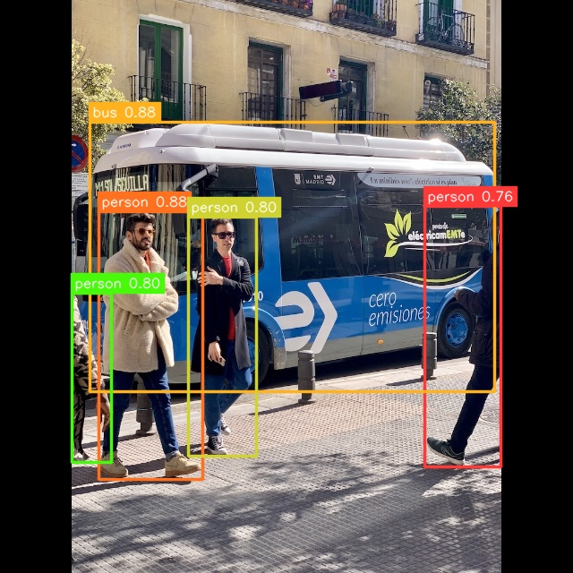

# YOLO26 Example

## Usage

Make sure you have downloaded the data files first for the examples.
You only need to do this once for all examples.

```
cd example/
git clone --depth=1 https://github.com/swdee/go-rknnlite-data.git data
```

Run the YOLOv8 example on rk3588 or replace with your Platform model.
```
cd example/yolo26
go run yolo26.go -p rk3588
```

This will result in the output of:
```
Driver Version: 0.9.6, API Version: 2.3.0 (c949ad889d@2024-11-07T11:35:33)
Model Input Number: 1, Output Number: 6
Input tensors:
  index=0, name=images, n_dims=4, dims=[1, 640, 640, 3], n_elems=1228800, size=1228800, fmt=NHWC, type=INT8, qnt_type=AFFINE, zp=-128, scale=0.003922
Output tensors:
  index=0, name=output0_reg, n_dims=4, dims=[1, 4, 80, 80], n_elems=25600, size=25600, fmt=NCHW, type=INT8, qnt_type=AFFINE, zp=-112, scale=0.046363
  index=1, name=output0_cls, n_dims=4, dims=[1, 80, 80, 80], n_elems=512000, size=512000, fmt=NCHW, type=INT8, qnt_type=AFFINE, zp=122, scale=0.171365
  index=2, name=output1_reg, n_dims=4, dims=[1, 4, 40, 40], n_elems=6400, size=6400, fmt=NCHW, type=INT8, qnt_type=AFFINE, zp=-123, scale=0.058620
  index=3, name=output1_cls, n_dims=4, dims=[1, 80, 40, 40], n_elems=128000, size=128000, fmt=NCHW, type=INT8, qnt_type=AFFINE, zp=116, scale=0.230135
  index=4, name=output2_reg, n_dims=4, dims=[1, 4, 20, 20], n_elems=1600, size=1600, fmt=NCHW, type=INT8, qnt_type=AFFINE, zp=-128, scale=0.075862
  index=5, name=output2_cls, n_dims=4, dims=[1, 80, 20, 20], n_elems=32000, size=32000, fmt=NCHW, type=INT8, qnt_type=AFFINE, zp=116, scale=0.281672
person @ (474 230 559 521) 0.759635
person @ (110 236 226 535) 0.877794
bus @ (100 136 552 437) 0.877794
person @ (210 242 286 509) 0.803507
person @ (80 327 124 516) 0.803507
Model first run speed: inference=51.683243ms, post processing=1.397932ms, rendering=734.986µs, total time=53.816161ms
Saved object detection result to ../data/bus-yolo26-out.jpg
Benchmark count=100 warmup=5
inference: min=37.005976ms p50=37.063141ms p90=37.550507ms max=74.717479ms
postprocess: min=1.169853ms p50=1.215936ms p90=1.321517ms max=27.223658ms
render: min=503.407µs p50=526.157µs p90=590.322µs max=6.212968ms
total: min=38.868233ms p50=38.969439ms p90=39.623926ms max=87.173455ms
done
```

The saved JPG image with object detection markers.




To use your own RKNN compiled model and images.
```
go run yolov8.go -m <RKNN model file> -i <image file> -l <labels txt file> -o <output jpg file> -p <platform>
```

The labels file should be a text file containing the labels the Model was trained on.
It should have one label per line.


See the help for command line parameters.
```
$ go run yolo26.go --help
Usage of /tmp/go-build3923814106/b001/exe/yolo26:
  -i string
        Image file to run object detection on (default "../data/bus.jpg")
  -l string
        Text file containing model labels (default "../data/coco_80_labels_list.txt")
  -m string
        RKNN compiled YOLO model file (default "../data/models/rk3588/yolo26s-rk3588.rknn")
  -o string
        The output JPG file with object detection markers (default "../data/bus-yolo26-out.jpg")
  -p string
        Rockchip CPU Model number [rk3562|rk3566|rk3568|rk3576|rk3582|rk3582|rk3588] (default "rk3588")
```


### Docker

To run the YOLO26 example using the prebuilt docker image, make sure the data files have been downloaded first,
then run.
```
# from project root directory

docker run --rm \
  --device /dev/dri:/dev/dri \
  -v "$(pwd):/go/src/app" \
  -v "$(pwd)/example/data:/go/src/data" \
  -v "/usr/include/rknn_api.h:/usr/include/rknn_api.h" \
  -v "/usr/lib/librknnrt.so:/usr/lib/librknnrt.so" \
  -w /go/src/app \
  swdee/go-rknnlite:latest \
  go run ./example/yolo26/yolo26.go -p rk3588
```

## Proprietary Models

The example YOLO26 model used has been trained on the COCO dataset so makes use
of the default Post Processor setup.  If you have trained your own Model and have
set specific Classes or want to use alternative
Box and NMS Threshold values, then initialize the `postprocess.NewYOLO26`
with your own `YOLO26Params`.

In the file `postprocess/yolo26.go` see function `YOLO26COCOParams` for how to
configure your own custom parameters.


## Ultralytics Fork

Rockchips toolkit and NPU do not support the `TopK` operator used in YOLO26 so Ultralytics
[does not support](https://github.com/ultralytics/ultralytics/issues/23340) exporting to 
an ONNX a compatible model.

To export your own models you need to use the [Ultralytics YOLO26 fork](https://github.com/zycer/yolo26_rknn_ultralytics).

Check out the forked code to your development environment and install into a python virtual environment.
```
git clone https://github.com/zycer/yolo26_rknn_ultralytics.git
cd yolo26_rknn_ultralytics
pip install -e .
pip install onnxscript
```

Export your model to an RKNN compatible ONNX format.
```
yolo export model=yolo26s.pt format=rknn opset=19
```

Then use [rknn-toolkit2](https://github.com/airockchip/rknn-toolkit2) to convert the `yolo26s.onnx` to RKNN format
with the conversion script provided in the yolo26_rknn_ultralytics repository, eg:
```
python rknn_export/convert.py --model-path yolo26s.onnx --platform rk3588 --dtype i8
```

## Benchmarks

The following table shows a comparison of the benchmark results across the three distinct platforms.


| Platform | Average Inference Time Per Image (p50) |
|----------|----------------------------------------|
| rk3588   | 38.9ms                                 |
| rk3576   | 42.6ms                                 |
| rk3566   | 144.1ms                               |

Note that these examples are only using a single NPU core to run inference on.  The results
would be different when running a Pool of models using all NPU cores available.  Secondly
the Rock 4D (rk3576) has DDR5 memory versus the Rock 5B (rk3588) with slower DDR4 memory.


## Background

This YOLO26 code was based on the work of the [C++ demo](https://github.com/li2390893/yolo26-rk3588-cpp)
