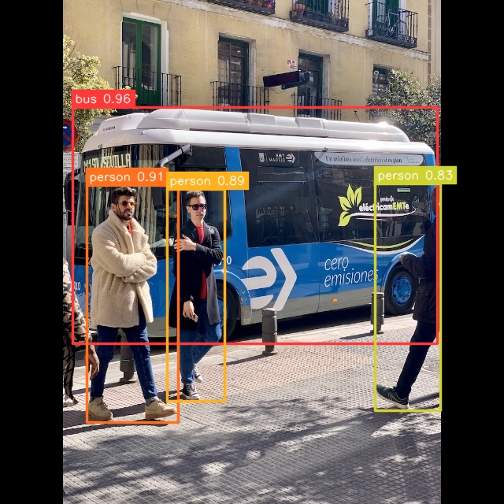

# YOLOv10 Example


## Usage

Make sure you have downloaded the data files first for the examples.
You only need to do this once for all examples.

```
cd example/
git clone --depth=1 https://github.com/swdee/go-rknnlite-data.git data
```

Run the YOLOv10 example.
```
cd example/yolov10
go run yolov10.go
```

This will result in the output of:
```
Driver Version: 0.8.2, API Version: 1.6.0 (9a7b5d24c@2023-12-13T17:31:11)
Model Input Number: 1, Ouput Number: 6
Input tensors:
  index=0, name=images, n_dims=4, dims=[1, 640, 640, 3], n_elems=1228800, size=1228800, fmt=NHWC, type=INT8, qnt_type=AFFINE, zp=-128, scale=0.003922
Output tensors:
  index=0, name=502, n_dims=4, dims=[1, 64, 80, 80], n_elems=409600, size=409600, fmt=NCHW, type=INT8, qnt_type=AFFINE, zp=-62, scale=0.086849
  index=1, name=516, n_dims=4, dims=[1, 80, 80, 80], n_elems=512000, size=512000, fmt=NCHW, type=INT8, qnt_type=AFFINE, zp=-128, scale=0.002931
  index=2, name=523, n_dims=4, dims=[1, 64, 40, 40], n_elems=102400, size=102400, fmt=NCHW, type=INT8, qnt_type=AFFINE, zp=-55, scale=0.072764
  index=3, name=537, n_dims=4, dims=[1, 80, 40, 40], n_elems=128000, size=128000, fmt=NCHW, type=INT8, qnt_type=AFFINE, zp=-128, scale=0.003646
  index=4, name=544, n_dims=4, dims=[1, 64, 20, 20], n_elems=25600, size=25600, fmt=NCHW, type=INT8, qnt_type=AFFINE, zp=-68, scale=0.058066
  index=5, name=558, n_dims=4, dims=[1, 80, 20, 20], n_elems=32000, size=32000, fmt=NCHW, type=INT8, qnt_type=AFFINE, zp=-128, scale=0.003894
bus @ (92 136 555 436) 0.958003
person @ (110 235 226 536) 0.907376
person @ (212 240 285 509) 0.887905
person @ (476 233 559 521) 0.829490
Model first run speed: inference=58.666351ms, post processing=2.771067ms, rendering=1.236349ms, total time=62.673767ms
Saved object detection result to ../data/bus-yolov10-out.jpg
Benchmark time=4.144871338s, count=100, average total time=41.448713ms
done
```

The saved JPG image with object detection markers.




To use your own RKNN compiled model and images.
```
go run yolov10.go -m <RKNN model file> -i <image file> -l <labels txt file> -o <output jpg file>
```

The labels file should be a text file containing the labels the Model was trained on.
It should have one label per line.


### Docker

To run the YOLOv10 example using the prebuilt docker image, make sure the data files have been downloaded first,
then run.
```
# from project root directory

docker run --rm \
  --device /dev/dri:/dev/dri \
  -v "$(pwd):/go/src/app" \
  -v "$(pwd)/example/data:/go/src/data" \
  -v "/usr/include/rknn_api.h:/usr/include/rknn_api.h" \
  -v "/usr/lib/librknnrt.so:/usr/lib/librknnrt.so" \
  -w /go/src/app \
  swdee/go-rknnlite:latest \
  go run ./example/yolov10/yolov10.go
```


## Proprietary Models

The example YOLOv10 model used has been trained on the COCO dataset so makes use
of the default Post Processor setup.  If you have trained your own Model and have
set specific Classes or want to use alternative
Box and NMS Threshold values, then initialize the `postprocess.NewYOLOv10`
with your own `YOLOv10Params`.

In the file `postprocess/yolov10.go` see function `YOLOv10COCOParams` for how to
configure your own custom parameters.


## Background

This YOLOv10 example is a Go conversion of the [C API example](https://github.com/airockchip/rknn_model_zoo/blob/main/examples/yolov10/cpp/main.cc).


