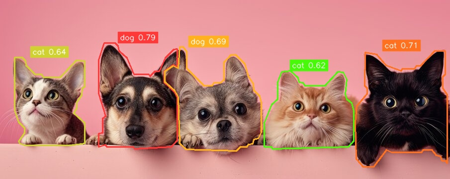
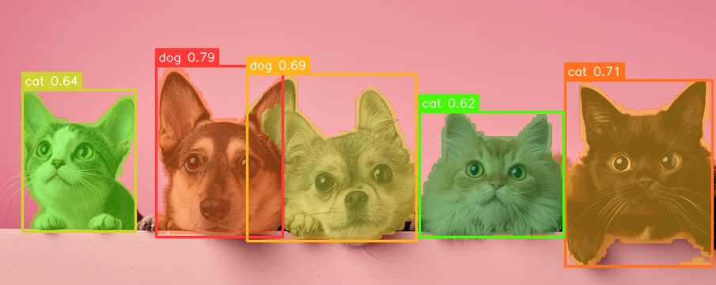
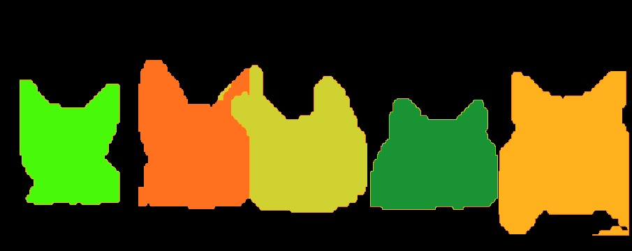

# YOLOv5-seg Example

This demo uses a YOLOv5-seg model to detect objects and provides 
instance segmentation. 


## Usage

Make sure you have downloaded the data files first for the examples.
You only need to do this once for all examples.

```
cd example/
git clone https://github.com/swdee/go-rknnlite-data.git data
```

Run the YOLOv5-seg example.
```
cd example/yolov5-seg
go run yolov5-seg.go
```

This will result in the output of:
```
Driver Version: 0.8.2, API Version: 1.6.0 (9a7b5d24c@2023-12-13T17:31:11)
Model Input Number: 1, Ouput Number: 7
Input tensors:
  index=0, name=images, n_dims=4, dims=[1, 640, 640, 3], n_elems=1228800, size=1228800, fmt=NHWC, type=INT8, qnt_type=AFFINE, zp=-128, scale=0.003922
Output tensors:
  index=0, name=output0, n_dims=4, dims=[1, 255, 80, 80], n_elems=1632000, size=1632000, fmt=NCHW, type=INT8, qnt_type=AFFINE, zp=-128, scale=0.003922
  index=1, name=output1, n_dims=4, dims=[1, 96, 80, 80], n_elems=614400, size=614400, fmt=NCHW, type=INT8, qnt_type=AFFINE, zp=20, scale=0.022222
  index=2, name=376, n_dims=4, dims=[1, 255, 40, 40], n_elems=408000, size=408000, fmt=NCHW, type=INT8, qnt_type=AFFINE, zp=-128, scale=0.003922
  index=3, name=377, n_dims=4, dims=[1, 96, 40, 40], n_elems=153600, size=153600, fmt=NCHW, type=INT8, qnt_type=AFFINE, zp=29, scale=0.023239
  index=4, name=379, n_dims=4, dims=[1, 255, 20, 20], n_elems=102000, size=102000, fmt=NCHW, type=INT8, qnt_type=AFFINE, zp=-128, scale=0.003918
  index=5, name=380, n_dims=4, dims=[1, 96, 20, 20], n_elems=38400, size=38400, fmt=NCHW, type=INT8, qnt_type=AFFINE, zp=32, scale=0.024074
  index=6, name=371, n_dims=4, dims=[1, 32, 160, 160], n_elems=819200, size=819200, fmt=NCHW, type=INT8, qnt_type=AFFINE, zp=-116, scale=0.022475
dog @ (197 83 357 299) 0.786010
cat @ (714 101 900 336) 0.706588
dog @ (312 93 526 304) 0.693387
cat @ (28 113 171 292) 0.641764
cat @ (530 141 712 299) 0.616804
Model first run speed: inference=53.284047ms, post processing=46.035115ms, rendering=7.266431ms, total time=106.585593ms
Saved object detection result to ../data/catdog-yolov5-seg-out.jpg
Benchmark time=1.998158455s, count=20, average total time=99.907922ms
done
```

The saved JPG image with instance segmentation outlines.




See the help for command line parameters.
```
$ go run yolov5-seg.go --help

Usage of /tmp/go-build401282281/b001/exe/yolov5-seg:
  -i string
        Image file to run object detection on (default "../data/catdog.jpg")
  -l string
        Text file containing model labels (default "../data/coco_80_labels_list.txt")
  -m string
        RKNN compiled YOLO model file (default "../data/yolov5s-seg-640-640-rk3588.rknn")
  -o string
        The output JPG file with object detection markers (default "../data/catdog-yolov5-seg-out.jpg")
  -r string
        The rendering format used for instance segmentation [outline|mask|dump] (default "outline")
```


## Rendering Methods

The default rendering method is to draw an outline around the edge of the detected
object as depicted in the image above.   This method however takes the most
resources to calculate and is more noticable if the scene has more objects in it.

A faster method of rendering is also provided which draws the bounding boxes around
the object and provides a single transparent overlay to indicate the segment mask.

This can be output with the following flag.
```
go run yolov5-seg.go -r mask
```



For visualisation and debugging purposes the segmentation mask can also be dumped
to an image.
```
go run yolov5-seg.go -r dump
```




## Model Segment Mask Size

The Rockchip examples are based on Models with an input tensor size of 640x640 with
3 channels (RGB).  The output tensor for the segment mask size is 160x160.

If your Model has been trained with a different output segment mask size such as 320x320
you will need to pass those sizes to the `YOLOv8SegParams.Prototype*` variables, eg:

```
// start with default COCO Parameters
yParams := postprocess.YOLOv5SegCOCOParams()

// Set your Models output mask size
yParams.PrototypeHeight = 320
yParams.PrototypeWeight = 320

// create YOLO Processor instance	
yoloProcesser := postprocess.NewYOLOv5Seg(yParams)
```


## Background

This YOLOv5-seg example is a Go conversion of the [C API example](https://github.com/airockchip/rknn_model_zoo/blob/main/examples/yolov5_seg/cpp/main.cc)
with improvements made to it inspired by [Ultralytics Instance Segmentation](https://docs.ultralytics.com/guides/instance-segmentation-and-tracking/#what-is-instance-segmentation).

