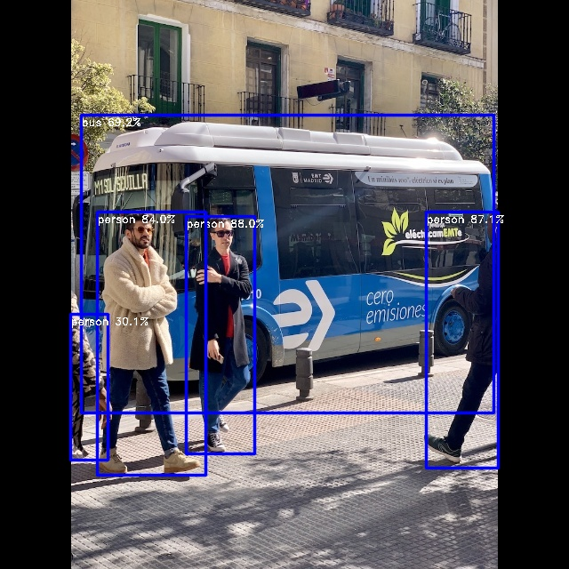

# YOLOv5 Example


## Usage

Make sure you have downloaded the data files first for the examples.
You only need to do this once for all examples.

```
cd example/
git clone https://github.com/swdee/go-rknnlite-data.git data
```

Run the Yolov5 example.
```
cd example/yolov5
go run yolov5.go
```

This will result in the output of:
```
Driver Version: 0.8.2, API Version: 1.6.0 (9a7b5d24c@2023-12-13T17:31:11)
Model Input Number: 1, Ouput Number: 3
Input tensors:
  index=0, name=images, n_dims=4, dims=[1, 640, 640, 3], n_elems=1228800, size=1228800, fmt=NHWC, type=INT8, qnt_type=AFFINE, zp=-128, scale=0.003922
Output tensors:
  index=0, name=output0, n_dims=4, dims=[1, 255, 80, 80], n_elems=1632000, size=1632000, fmt=NCHW, type=INT8, qnt_type=AFFINE, zp=-128, scale=0.003922
  index=1, name=286, n_dims=4, dims=[1, 255, 40, 40], n_elems=408000, size=408000, fmt=NCHW, type=INT8, qnt_type=AFFINE, zp=-128, scale=0.003922
  index=2, name=288, n_dims=4, dims=[1, 255, 20, 20], n_elems=102000, size=102000, fmt=NCHW, type=INT8, qnt_type=AFFINE, zp=-128, scale=0.003922
person @ (209 243 286 510) 0.879723
person @ (479 238 560 526) 0.870588
person @ (109 238 231 534) 0.839831
bus @ (91 129 555 464) 0.692042
person @ (79 353 121 517) 0.300961
Model first run speed: inference=32.144783ms, post processing=422.908µs, rendering=1.405512ms, total time=33.973203ms
Saved object detection result to ../data/bus-yolov5-out.jpg
Benchmark time=2.104920231s, count=100, average total time=21.049202ms
done
```

The saved JPG image with object detection markers.




To use your own RKNN compiled model and images.
```
go run yolov5.go -m <RKNN model file> -i <image file> -l <labels txt file> -o <output jpg file>
```

The labels file should be a text file containing the labels the Model was trained on.
It should have one label per line.


## Proprietary Models

The example YOLOv5 model used has been trained on the COCO dataset so makes use
of the default Post Processor setup.  If you have trained your own Model and have
set specific Anchor Boxes, Classes, Strides, or want to use alternative
Box and NMS Threshold values, then initialize the `postprocess.NewYOLOv5`
with your own `YOLOv5Params`.

In the file `postprocess/yolov5.go` see function `YOLOv5COCOParams` for how to
configure your own custom parameters. 


## Background

This YOLOv5 example is a Go conversion of the [C API example](https://github.com/airockchip/rknn-toolkit2/blob/v1.6.0/rknpu2/examples/rknn_yolov5_demo/src/main.cc).

