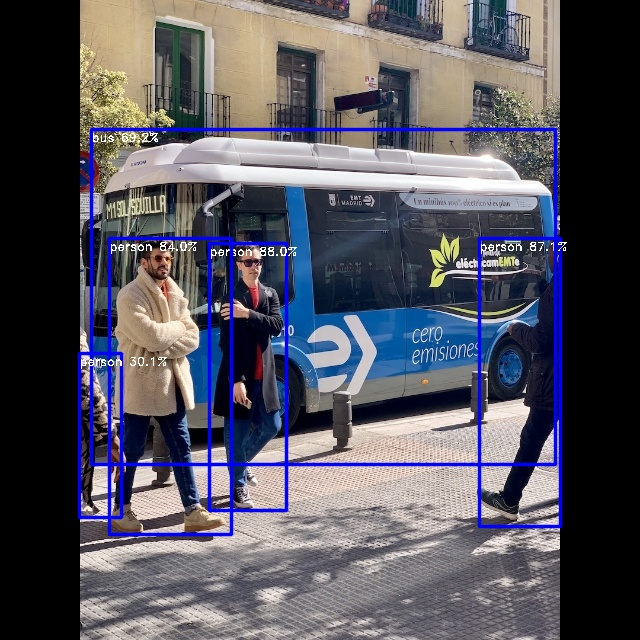

# YOLOv5 Example


## Usage

Make sure you have downloaded the data files first for the examples.
You only need to do this once for all examples.

```
cd example/
git clone --depth=1 https://github.com/swdee/go-rknnlite-data.git data
```

Run the Yolov5 example on rk3588 or replace with your Platform model.
```
cd example/yolov5
go run yolov5.go -p rk3588
```

This will result in the output of:
```
Driver Version: 0.9.6, API Version: 2.3.0 (c949ad889d@2024-11-07T11:35:33)
Model Input Number: 1, Ouput Number: 3
Input tensors:
  index=0, name=images, n_dims=4, dims=[1, 640, 640, 3], n_elems=1228800, size=1228800, fmt=NHWC, type=INT8, qnt_type=AFFINE, zp=-128, scale=0.003922
Output tensors:
  index=0, name=output0, n_dims=4, dims=[1, 255, 80, 80], n_elems=1632000, size=1632000, fmt=NCHW, type=INT8, qnt_type=AFFINE, zp=-128, scale=0.003922
  index=1, name=343, n_dims=4, dims=[1, 255, 40, 40], n_elems=408000, size=408000, fmt=NCHW, type=INT8, qnt_type=AFFINE, zp=-128, scale=0.003922
  index=2, name=345, n_dims=4, dims=[1, 255, 20, 20], n_elems=102000, size=102000, fmt=NCHW, type=INT8, qnt_type=AFFINE, zp=-128, scale=0.003922
person @ (210 242 282 519) 0.831880
person @ (474 229 561 522) 0.805398
person @ (114 239 207 540) 0.788235
bus @ (90 135 553 459) 0.771211
person @ (78 331 122 519) 0.413103
Model first run speed: inference=33.508668ms, post processing=191.914µs, rendering=733.236µs, total time=34.433818ms
Saved object detection result to ../data/bus-yolov5-out.jpg
Benchmark count=100 warmup=5
inference: min=25.271571ms p50=25.550983ms p90=37.023769ms max=44.02043ms
postprocess: min=395.784µs p50=457.325µs p90=1.300225ms max=1.466181ms
render: min=1.496222ms p50=1.545804ms p90=4.097257ms max=4.564206ms
total: min=27.443864ms p50=27.796191ms p90=43.173738ms max=50.710265ms
done
```

The saved JPG image with object detection markers.




To use your own RKNN compiled model and images.
```
go run yolov5.go -m <RKNN model file> -i <image file> -l <labels txt file> -o <output jpg file> -p <platform>
```

The labels file should be a text file containing the labels the Model was trained on.
It should have one label per line.


See the help for command line parameters.
```
$ go run yolov5.go --help

Usage of /tmp/go-build3921202332/b001/exe/yolov5:
  -i string
        Image file to run object detection on (default "../data/bus.jpg")
  -l string
        Text file containing model labels (default "../data/coco_80_labels_list.txt")
  -m string
        RKNN compiled YOLO model file (default "../data/models/rk3588/yolov5s-rk3588.rknn")
  -o string
        The output JPG file with object detection markers (default "../data/bus-yolov5-out.jpg")
  -p string
        Rockchip CPU Model number [rk3562|rk3566|rk3568|rk3576|rk3582|rk3582|rk3588] (default "rk3588")
```


### Docker

To run the YOLOv5 example using the prebuilt docker image, make sure the data files have been downloaded first,
then run.
```
# from project root directory

docker run --rm \
  --device /dev/dri:/dev/dri \
  -v "$(pwd):/go/src/app" \
  -v "$(pwd)/example/data:/go/src/data" \
  -v "/usr/include/rknn_api.h:/usr/include/rknn_api.h" \
  -v "/usr/lib/librknnrt.so:/usr/lib/librknnrt.so" \
  -w /go/src/app \
  swdee/go-rknnlite:latest \
  go run ./example/yolov5/yolov5.go -p rk3588
```


## Proprietary Models

The example YOLOv5 model used has been trained on the COCO dataset so makes use
of the default Post Processor setup.  If you have trained your own Model and have
set specific Anchor Boxes, Classes, Strides, or want to use alternative
Box and NMS Threshold values, then initialize the `postprocess.NewYOLOv5`
with your own `YOLOv5Params`.

In the file `postprocess/yolov5.go` see function `YOLOv5COCOParams` for how to
configure your own custom parameters. 


## Benchmarks

The following table shows a comparison of the benchmark results across the three distinct platforms.


| Platform | Average Inference Time Per Image (p50) |
|----------|----------------------------------------|
| rk3588   | 27.7ms                                 |
| rk3576   | 28.8ms                                 |
| rk3566   | 65.8ms                                 |

Note that these examples are only using a single NPU core to run inference on.  The results
would be different when running a Pool of models using all NPU cores available.  Secondly
the Rock 4D (rk3576) has DDR5 memory versus the Rock 5B (rk3588) with slower DDR4 memory which
explains the faster result. 


## Background

This YOLOv5 example is a Go conversion of the [C API example](https://github.com/airockchip/rknn-toolkit2/blob/v1.6.0/rknpu2/examples/rknn_yolov5_demo/src/main.cc).

