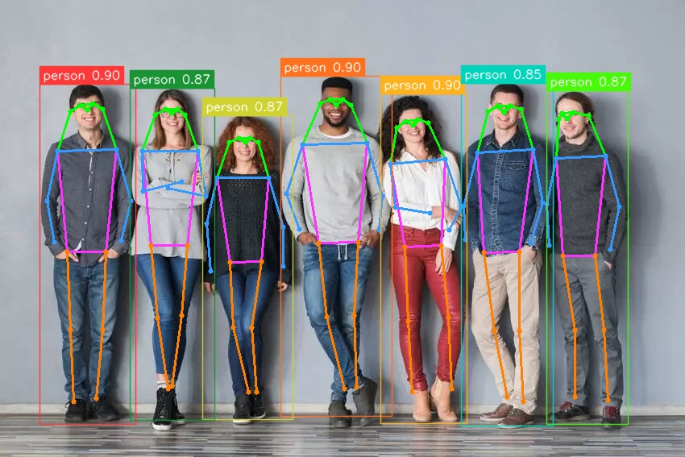

# YOLOv8-pose Example


## Usage

Make sure you have downloaded the data files first for the examples.
You only need to do this once for all examples.

```
cd example/
git clone https://github.com/swdee/go-rknnlite-data.git data
```

Run the YOLOv8-pose example.
```
cd example/yolov8-pose
go run yolov8-pose.go
```

This will result in the output of:
```
Driver Version: 0.8.2, API Version: 1.6.0 (9a7b5d24c@2023-12-13T17:31:11)
Model Input Number: 1, Ouput Number: 4
Input tensors:
  index=0, name=images, n_dims=4, dims=[1, 640, 640, 3], n_elems=1228800, size=1228800, fmt=NHWC, type=INT8, qnt_type=AFFINE, zp=-128, scale=0.003922
Output tensors:
  index=0, name=/model.22/Concat_1_output_0, n_dims=4, dims=[1, 65, 80, 80], n_elems=416000, size=416000, fmt=NCHW, type=INT8, qnt_type=AFFINE, zp=31, scale=0.141366
  index=1, name=/model.22/Concat_2_output_0, n_dims=4, dims=[1, 65, 40, 40], n_elems=104000, size=104000, fmt=NCHW, type=INT8, qnt_type=AFFINE, zp=67, scale=0.235531
  index=2, name=/model.22/Concat_3_output_0, n_dims=4, dims=[1, 65, 20, 20], n_elems=26000, size=26000, fmt=NCHW, type=INT8, qnt_type=AFFINE, zp=50, scale=0.159995
  index=3, name=/model.22/Concat_6_output_0, n_dims=4, dims=[1, 17, 3, 8400], n_elems=428400, size=856800, fmt=NCHW, type=FP16, qnt_type=AFFINE, zp=0, scale=1.000000
person @ (49 104 168 526) 0.903778
person @ (348 94 486 516) 0.903778
person @ (472 116 579 525) 0.903778
person @ (251 143 363 520) 0.872132
person @ (678 112 779 526) 0.872132
person @ (161 109 266 521) 0.872132
person @ (572 103 686 528) 0.853203
Model first run speed: inference=54.180286ms, post processing=1.000141ms, rendering=3.057007ms, total time=58.237434ms
Saved object detection result to ../data/people-yolov8-pose-out.jpg
Benchmark time=951.037868ms, count=20, average total time=47.551893ms
done
```

The saved JPG image with pose estimation markers.




## Background

This YOLOv8-pose example is a Go conversion of the [C API example](https://github.com/airockchip/rknn_model_zoo/blob/main/examples/yolov8_pose/cpp/main.cc).

