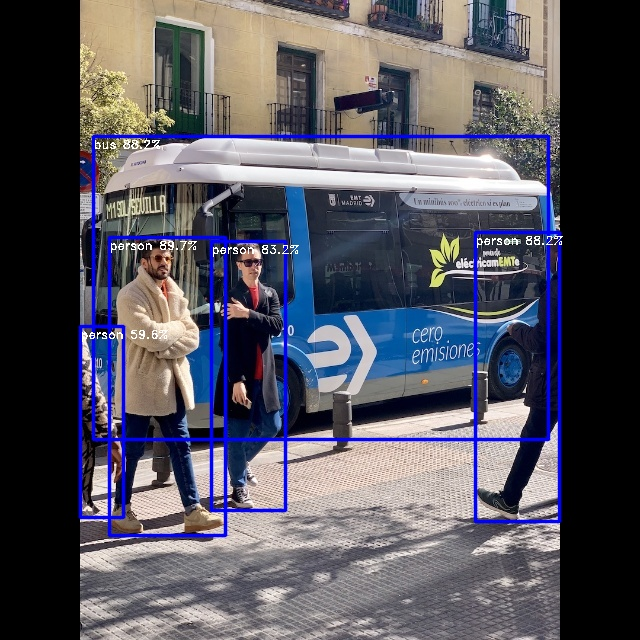

# YOLOv8 Example


## Usage

Make sure you have downloaded the data files first for the examples.
You only need to do this once for all examples.

```
cd example/
git clone https://github.com/swdee/go-rknnlite-data.git data
```

Run the Yolov8 example.
```
cd example/yolov8
go run yolov8.go
```

This will result in the output of:
```
Driver Version: 0.8.2, API Version: 1.6.0 (9a7b5d24c@2023-12-13T17:31:11)
Model Input Number: 1, Ouput Number: 9
Input tensors:
  index=0, name=images, n_dims=4, dims=[1, 640, 640, 3], n_elems=1228800, size=1228800, fmt=NHWC, type=INT8, qnt_type=AFFINE, zp=-128, scale=0.003922
Output tensors:
  index=0, name=318, n_dims=4, dims=[1, 64, 80, 80], n_elems=409600, size=409600, fmt=NCHW, type=INT8, qnt_type=AFFINE, zp=-56, scale=0.110522
  index=1, name=onnx::ReduceSum_326, n_dims=4, dims=[1, 80, 80, 80], n_elems=512000, size=512000, fmt=NCHW, type=INT8, qnt_type=AFFINE, zp=-128, scale=0.003452
  index=2, name=331, n_dims=4, dims=[1, 1, 80, 80], n_elems=6400, size=6400, fmt=NCHW, type=INT8, qnt_type=AFFINE, zp=-128, scale=0.003482
  index=3, name=338, n_dims=4, dims=[1, 64, 40, 40], n_elems=102400, size=102400, fmt=NCHW, type=INT8, qnt_type=AFFINE, zp=-17, scale=0.098049
  index=4, name=onnx::ReduceSum_346, n_dims=4, dims=[1, 80, 40, 40], n_elems=128000, size=128000, fmt=NCHW, type=INT8, qnt_type=AFFINE, zp=-128, scale=0.003592
  index=5, name=350, n_dims=4, dims=[1, 1, 40, 40], n_elems=1600, size=1600, fmt=NCHW, type=INT8, qnt_type=AFFINE, zp=-128, scale=0.003755
  index=6, name=357, n_dims=4, dims=[1, 64, 20, 20], n_elems=25600, size=25600, fmt=NCHW, type=INT8, qnt_type=AFFINE, zp=-49, scale=0.078837
  index=7, name=onnx::ReduceSum_365, n_dims=4, dims=[1, 80, 20, 20], n_elems=32000, size=32000, fmt=NCHW, type=INT8, qnt_type=AFFINE, zp=-128, scale=0.003817
  index=8, name=369, n_dims=4, dims=[1, 1, 20, 20], n_elems=400, size=400, fmt=NCHW, type=INT8, qnt_type=AFFINE, zp=-128, scale=0.003835
person @ (109 237 225 535) 0.896928
bus @ (93 136 548 439) 0.881662
person @ (475 232 559 521) 0.881662
person @ (211 241 285 510) 0.832044
person @ (80 326 123 517) 0.596252
Model first run speed: inference=49.146842ms, post processing=4.291201ms, rendering=1.419804ms, total time=54.857847ms
Saved object detection result to ../data/bus-yolov8-out.jpg
Benchmark time=805.490284ms, count=20, average total time=40.274514ms
done
```

The saved JPG image with object detection markers.




To use your own RKNN compiled model and images.
```
go run yolov8.go -m <RKNN model file> -i <image file> -l <labels txt file> -o <output jpg file>
```

The labels file should be a text file containing the labels the Model was trained on.
It should have one label per line.


## Proprietary Models

The example YOLOv8 model used has been trained on the COCO dataset so makes use
of the default Post Processor setup.  If you have trained your own Model and have
set specific Classes or want to use alternative
Box and NMS Threshold values, then initialize the `postprocess.NewYOLOv8`
with your own `YOLOv8Params`.

In the file `postprocess/yolov8.go` see function `YOLOv8COCOParams` for how to
configure your own custom parameters.


## Background

This YOLOv8 example is a Go conversion of the [C API example](https://github.com/airockchip/rknn_model_zoo/blob/main/examples/yolov8/cpp/main.cc).

