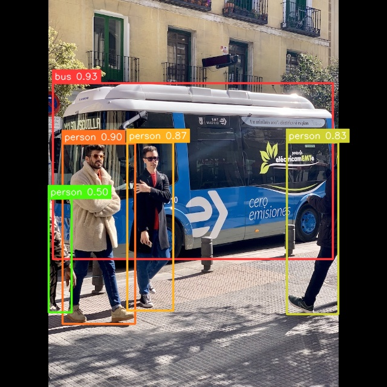

# YOLOX Example


## Usage

Make sure you have downloaded the data files first for the examples.
You only need to do this once for all examples.

```
cd example/
git clone https://github.com/swdee/go-rknnlite-data.git data
```

Run the YOLOX example.
```
cd example/yolox
go run yolox.go
```

This will result in the output of:
```
Driver Version: 0.8.2, API Version: 1.6.0 (9a7b5d24c@2023-12-13T17:31:11)
Model Input Number: 1, Ouput Number: 3
Input tensors:
  index=0, name=images, n_dims=4, dims=[1, 640, 640, 3], n_elems=1228800, size=1228800, fmt=NHWC, type=INT8, qnt_type=AFFINE, zp=-128, scale=1.000000
Output tensors:
  index=0, name=output, n_dims=4, dims=[1, 85, 80, 80], n_elems=544000, size=544000, fmt=NCHW, type=INT8, qnt_type=AFFINE, zp=-28, scale=0.022949
  index=1, name=788, n_dims=4, dims=[1, 85, 40, 40], n_elems=136000, size=136000, fmt=NCHW, type=INT8, qnt_type=AFFINE, zp=-26, scale=0.024599
  index=2, name=output.1, n_dims=4, dims=[1, 85, 20, 20], n_elems=34000, size=34000, fmt=NCHW, type=INT8, qnt_type=AFFINE, zp=-19, scale=0.021201
outputs= 3
Model first run speed: inference=46.785964ms, post processing=181.705µs, total time=46.967669ms
bus @ (87 137 550 428) 0.929565
person @ (103 237 223 535) 0.895541
person @ (210 235 286 513) 0.871337
person @ (474 235 559 519) 0.830675
person @ (80 328 118 516) 0.499204
Saved object detection result to ../data/bus-yolox-out.jpg
Benchmark time=3.478000278s, count=100, average total time=34.780002ms
done
```

The saved JPG image with object detection markers.




To use your own RKNN compiled model and images.
```
go run yolox.go -m <RKNN model file> -i <image file> -l <labels txt file> -o <output jpg file>
```

The labels file should be a text file containing the labels the Model was trained on.
It should have one label per line.


## Proprietary Models

The example YOLOX model used has been trained on the COCO dataset so makes use
of the default Post Processor setup.  If you have trained your own Model and have
set specific Classes, Strides, or want to use alternative
Box and NMS Threshold values, then initialize the `postprocess.NewYOLOX`
with your own `YOLOXParams`.

In the file `postprocess/yolox.go` see function `YOLOXCOCOParams` for how to
configure your own custom parameters.


## Background

This YOLOX example is a Go conversion of the [C API example](https://github.com/airockchip/rknn_model_zoo/blob/main/examples/yolox/cpp/main.cc).

